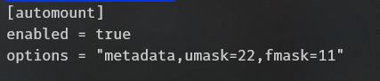
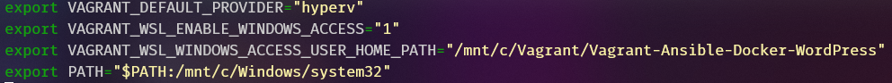
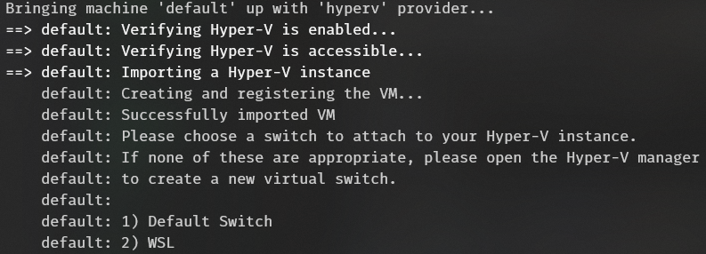
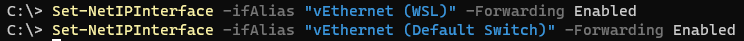

# WSL2-Vagrant-Ansible-Docker-WordPress


How to setup `Vagrant` with `Hyper-V` and `WSL2`

## Minimal Requirements 

1. Use the guide to setup `WSL`.

    ```sh
     https://docs.microsoft.com/en-us/windows/wsl/install-win10
    ```

2. Correct the `WSL` issue with file permitions.

    Create a file `/etc/wsl.conf` with following content. Reboot `WSL` - `Restart-Service LxssManager`

    ```sh
      [automount]
      enabled = true
      options = "metadata,umask=22,fmask=11"
    ```
      

3. Add this strings to your profile - `nano ~/.profile`.

    ```sh
      export VAGRANT_DEFAULT_PROVIDER="hyperv"
      export VAGRANT_WSL_ENABLE_WINDOWS_ACCESS="1"
      export VAGRANT_WSL_WINDOWS_ACCESS_USER_HOME_PATH="/mnt/c/Vagrant/YourProjectCatalog"
      export PATH="$PATH:/mnt/c/Windows/system32"
    ```
      

4. Installing `Vagrant`.

    `Vagrant` must be installed in `WSL` and `Windows`. Important note - version must be the same! 

    ```sh
    # https://www.vagrantup.com/downloads.html
    vagrant_url="https://releases.hashicorp.com/vagrant/2.2.14/vagrant_2.2.14_x86_64.deb"
    vagrant_filename="$(basename "$vagrant_url")"
    wget "$vagrant_url"
    sudo dpkg -i "$vagrant_filename"
    rm -f "$vagrant_filename"
    vagrant --version
    ```
5. `Vagrant` network issues  with `HyperV`.

    Now `Vagrant` does't know how to work with virtual switches of the `HyperV` and the possibility of static addressing is absent. Select the required switch - manually. The stability of work is declared only with `Default Switch`

      

6. Packets must flow :)

    Run these commands in the console of `PowerShell` from `Administrator`

    ```sh
      Set-NetIPInterface -ifAlias "vEthernet (WSL)" -Forwarding Enabled
      Set-NetIPInterface -ifAlias "vEthernet (Default Switch)" -Forwarding Enabled
    ```
      
 
## Useful Links.

     https://www.vagrantup.com/docs
     https://github.com/deluxebrain/wsl-vagrant-hyperv-setup

